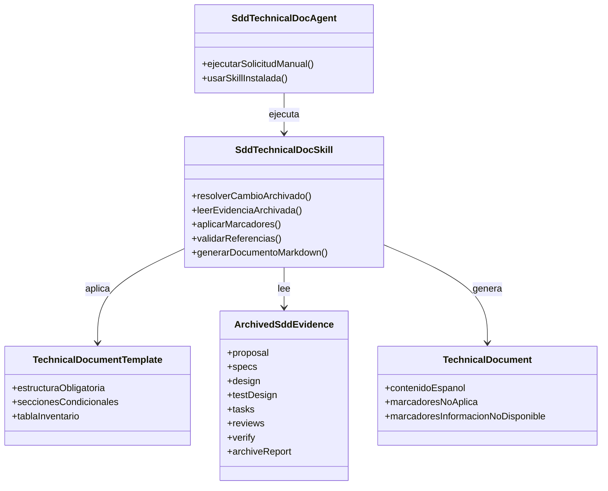
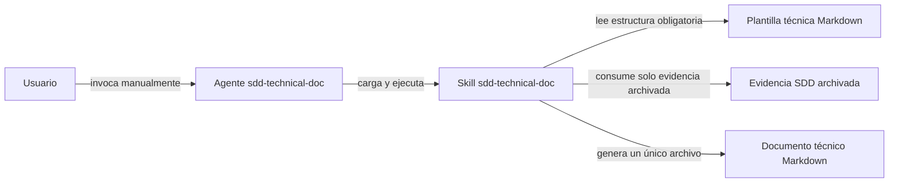
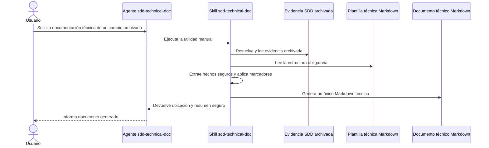
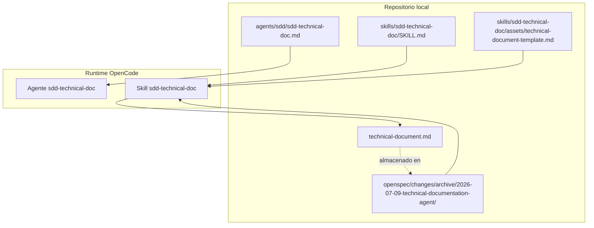
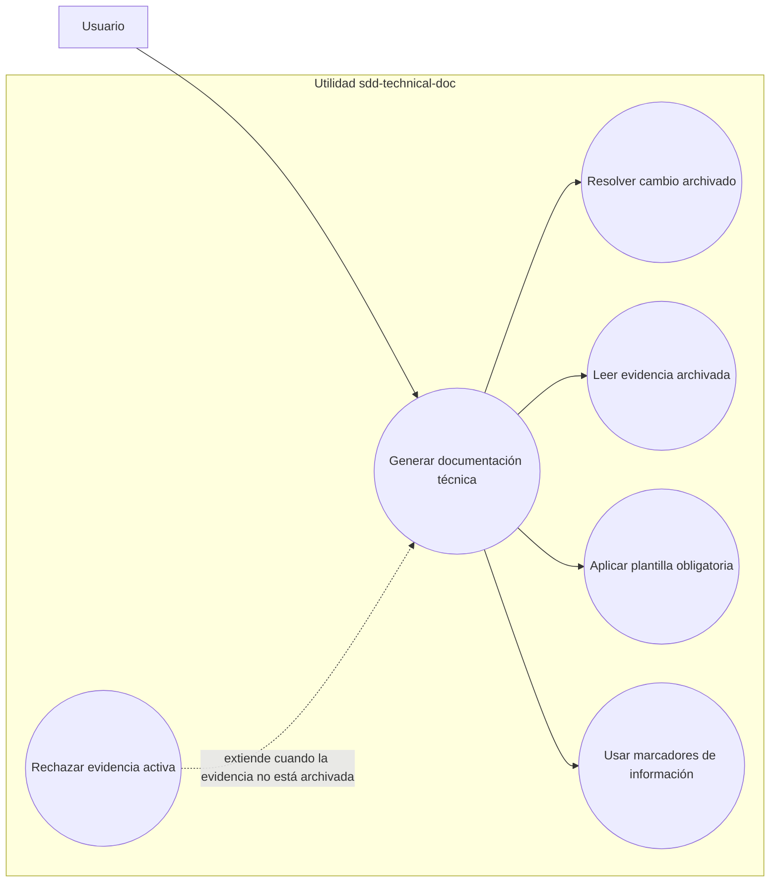

# Documentación Técnica: Technical Documentation Agent

## Identificación del Producto

| Producto | Dueño de aplicación | Plataforma | Líder de Proyecto TI | Desarrollador |
| --- | --- | --- | --- | --- |
| `sdd-technical-doc` | Información no disponible en la evidencia archivada. | OpenCode / SDD / OpenSpec | Información no disponible en la evidencia archivada. | Información no disponible en la evidencia archivada. |

### Referencias

No aplica.

# 1. Presentación del Producto

El cambio `technical-documentation-agent` incorporó una utilidad manual posterior al archivado llamada `sdd-technical-doc`. La utilidad genera un único documento técnico Markdown en español profesional a partir de evidencia SDD ya archivada, sin modificar el DAG activo, el ruteo de estado, las puertas de verificación, las puertas de archivado ni los artefactos archivados de la evidencia original.

## 1.1 Objetivo

Generar documentación técnica final y repetible para cambios SDD ya archivados, usando únicamente evidencia archivada y marcadores explícitos cuando una sección no aplica o cuando falta información.

## 1.2 Alcance

El alcance incluye la creación de una skill `sdd-technical-doc`, una plantilla Markdown en español, un agente ejecutor liviano y documentación del límite manual posterior al archivado en `README.md` y `AGENTS.md`. El cambio también sincronizó especificaciones OpenSpec fuente para dejar registrado que la utilidad no es una fase requerida del flujo SDD.

| Tipo | Esquema.Objeto | Operacion | Descripcion funcional |
| --- | --- | --- | --- |
| Información no disponible en la evidencia archivada. | `skills/sdd-technical-doc/SKILL.md` | CREATE | Contrato de ejecución manual posterior al archivado para generar documentación técnica desde evidencia archivada. |
| Información no disponible en la evidencia archivada. | `skills/sdd-technical-doc/assets/technical-document-template.md` | CREATE | Plantilla obligatoria en español para el documento técnico final. |
| Información no disponible en la evidencia archivada. | `agents/sdd/sdd-technical-doc.md` | CREATE | Prompt ejecutor liviano que usa la skill instalada y no delega a otros agentes. |
| Información no disponible en la evidencia archivada. | `AGENTS.md` | ALTER | Documentación de `sdd-technical-doc` como utilidad manual posterior al archivado. |
| Información no disponible en la evidencia archivada. | `README.md` | ALTER | Listado de la utilidad manual sin alterar el orden de fases SDD. |
| Información no disponible en la evidencia archivada. | `openspec/specs/sdd-technical-documentation-workflow/spec.md` | CREATE | Especificación fuente de la capacidad de documentación técnica manual posterior al archivado. |
| Información no disponible en la evidencia archivada. | `openspec/specs/sdd-execution-persistence-contracts/spec.md` | ALTER | Requisito fuente que preserva el límite no-DAG de `sdd-technical-doc`. |

Valores permitidos para `Tipo`: TABLE, INDEX, PACKAGE SPEC, PACKAGE BODY, PROCEDURE, FUNCTION, TRIGGER, JOB ControlM, VIEW, SEQUENCE, GRANT.

Valores permitidos para `Operacion`: CREATE, ALTER, REPLACE, DROP.

## 1.3 Sistemas Involucrados

- Repositorio de instrucciones SDD/OpenCode.
- OpenSpec como almacén de evidencia archivada para este cambio.
- Engram como memoria persistente de sesiones y decisiones asociadas.

## 1.4 Calendarización

| Operación runtime | Frecuencia | Ventana batch | Job ControlM | Observaciones |
| --- | --- | --- | --- | --- |
| No aplica. | No aplica. | No aplica. | No aplica. | La evidencia archivada indica que la utilidad es operativamente pasiva y se ejecuta solo por invocación manual del usuario. |

## 1.5 Definiciones, Acrónimos y Abreviaciones

- SDD: Spec-Driven Development.
- OpenSpec: almacén de artefactos de especificación y evidencia del flujo SDD.
- DAG: grafo de dependencias de fases SDD.
- `sdd-technical-doc`: utilidad manual posterior al archivado que genera documentación técnica desde evidencia archivada.
- `sdd-operational-doc`: utilidad manual posterior al archivado usada como patrón de referencia para el diseño.

# 2. Modelo Arquitectura

## 2.1 Vistas 4 + 1

### 2.1.1 Vista Lógica

La solución se compone de una skill `sdd-technical-doc`, una plantilla Markdown en español y un agente ejecutor liviano. La skill define reglas de activación, lectura de evidencia archivada, marcadores obligatorios, filtrado de referencias, validación del inventario y límites de seguridad para no inventar datos ni copiar valores restringidos.

#### Diagrama de clases

### 2.2.2 Vista de Desarrollo

El desarrollo agregó archivos de configuración/documentación para OpenCode y SDD: skill, plantilla, agente, documentación general y especificaciones OpenSpec. No incorporó código runtime de aplicación, servicios de red, autenticación, acceso a base de datos ni migraciones de datos.

#### Diagrama de componentes

### 2.3.3 Vista de Proceso

El proceso previsto es manual: el usuario invoca `sdd-technical-doc` para un cambio SDD ya archivado; la utilidad resuelve la carpeta o referencia archivada, lee la plantilla, extrae hechos seguros desde la evidencia archivada, completa todas las secciones con datos evidenciados o marcadores obligatorios, y produce un único Markdown técnico.

#### Diagrama de secuencia

### 2.3.4 Vista Física

La evidencia archivada ubica el cambio en `openspec/changes/archive/2026-07-09-technical-documentation-agent/`. La plantilla final reside en `skills/sdd-technical-doc/assets/technical-document-template.md`, y el agente en `agents/sdd/sdd-technical-doc.md`.

#### Diagrama de despliegue

### 2.3.5 Vista de Escenarios

- Escenario principal: el usuario solicita documentación técnica para un cambio archivado y recibe un único archivo Markdown en español.
- Escenario de sección no aplicable: la sección se completa exactamente con `No aplica.`.
- Escenario de información faltante: la sección o campo se completa exactamente con `Información no disponible en la evidencia archivada.`.
- Escenario de evidencia activa o no archivada: la utilidad debe detenerse y no generar desde artefactos activos.

#### Diagrama de casos de uso

## 2.2 Secciones aplicadas para la Plataforma de BI

No aplica.

## 2.3 Referencias de Estándares Usados

- Convenciones SDD del repositorio para utilidades manuales posteriores al archivado.
- Contrato de persistencia OpenSpec para evidencia archivada.
- Reglas de seguridad definidas en `design.md#Secure Development Design` para manejo seguro de evidencia, salida de archivos y resúmenes sanitizados.

## 2.4 Especificaciones de Hardware y Software

| Elemento | Especificación |
| --- | --- |
| Repositorio | Markdown instruction-contract repository. |
| Almacén de evidencia usado por el cambio archivado | OpenSpec. |
| Ruta archivada | `openspec/changes/archive/2026-07-09-technical-documentation-agent/`. |
| Runtime de aplicación | No aplica. |
| Runner de pruebas, build, linter, type checker, formatter y coverage | Información no disponible en la evidencia archivada. La evidencia archivada indica que no hay comandos configurados para este repositorio. |

## 2.5 Seguridad

El cambio fue clasificado como sensible para seguridad por agregar una utilidad que lee evidencia archivada y genera un documento final. Las reglas de seguridad archivadas exigen no copiar secretos, credenciales, tokens, llaves privadas, cadenas de conexión, PAN, PII, valores confidenciales de cliente, payloads crudos, hosts/IPs/puertos/SID productivos, listas completas de identificadores ni bytes generados en artefactos SDD, ejemplos, resúmenes o logs. La utilidad debe resumir evidencia por ruta, sección o descripción sanitizada y nunca rellenar artefactos SDD con valores finales provistos por el usuario.

## 2.6 Componentes para reutilizar

- Patrón manual posterior al archivado de `sdd-operational-doc`.
- Plantilla `skills/sdd-technical-doc/assets/technical-document-template.md` para documentos técnicos futuros.
- Contratos compartidos de persistencia y convenciones OpenSpec para resolver evidencia archivada.

## 2.7 Desglose de procesos (aplica para POS)

No aplica.

# 4. Requerimientos

## 4.1 Modelado de la aplicación

La solución se modela como una utilidad documental sin runtime propio. Su flujo es: evidencia SDD archivada → resolución de archivo/cambio → lectura de plantilla → extracción de hechos seguros → aplicación de marcadores obligatorios → generación de un único Markdown técnico.

No se anexan diagramas adicionales porque la evidencia archivada no contiene diagramas de clases, flujo, secuencia ni entidad-relación para este cambio.

## 4.2 Requerimientos de Sistemas

| ID | Nombre del requerimiento | Dependencias | Descripción | Tipo de Componentes | Componente a utilizar |
| --- | --- | --- | --- | --- | --- |
| TD-001 | Utilidad manual posterior al archivado | Cambio SDD archivado | `sdd-technical-doc` debe ser manual, invocable por usuario, consumidor de archivo y no una fase SDD requerida. | Skill / agente / documentación | `skills/sdd-technical-doc/SKILL.md`, `agents/sdd/sdd-technical-doc.md`, `README.md`, `AGENTS.md` |
| TD-007 | Documento Markdown único en español | Evidencia archivada legible | La utilidad debe producir exactamente un documento técnico Markdown en español profesional o devolverlo inline si no se indica ruta. | Plantilla / salida documental | `skills/sdd-technical-doc/assets/technical-document-template.md` |
| TD-011 | Marcador de sección no aplicable | Evidencia archivada | Las secciones no aplicables deben usar exactamente `No aplica.`. | Regla documental | Skill y plantilla |
| TD-012 | Marcador de información faltante | Evidencia archivada | La información aplicable pero ausente debe usar exactamente `Información no disponible en la evidencia archivada.`. | Regla documental | Skill y plantilla |
| TD-013 | Referencias finales restringidas | Evidencia archivada | Las referencias finales solo pueden incluir FCTI, historia y fuentes `.pks`, `.pkb` o `.sql` de packages/tablas creadas o modificadas. | Regla documental | Skill y plantilla |
| TD-014 | Exclusión de instaladores | Evidencia archivada | Los scripts instaladores no deben aparecer en referencias finales. | Regla documental | Skill y plantilla |
| TD-019 | Ruta de salida segura | Ruta objetivo opcional | Si se escribe a disco, debe preferirse una ruta Markdown local al archivo y leerse contenido existente antes de decidir sobrescritura. | Regla de archivo | Skill |

## 4.3 FrontEnd (Aplica para BI)

No aplica.

## 4.4 Restricciones de diseño

- La utilidad no debe convertirse en fase requerida del DAG SDD.
- No debe modificar orden de fases, ruteo de estado, dependencias, puertas de verificación ni puertas de archivado.
- Debe usar solo evidencia archivada y contexto final explícito provisto por el usuario.
- No debe inventar datos de producto, responsables, runtime, base de datos, seguridad, integración, objetos ni referencias.
- Debe usar marcadores exactos para información no aplicable o no disponible.
- Debe generar exactamente un documento Markdown en español profesional por invocación.

## 4.5 Requerimientos de Licencia

Información no disponible en la evidencia archivada.

## 4.6 Componentes Comprados

No aplica.

## 4.7 Interacción con otros sistemas

La utilidad interactúa con evidencia archivada de OpenSpec y, según el modo de persistencia disponible, puede resolver referencias archivadas del backend seleccionado. No agrega integraciones externas, llamadas de red, servicios de aplicación ni intercambio de información con sistemas productivos.

## 4.8 Requerimientos de base de datos, fuentes de información, destinos y procesamiento

| ID | Nombre del requerimiento | Dependencias | Descripción | Tipo de Componentes | Componente a utilizar |
| --- | --- | --- | --- | --- | --- |
| TD-006 | Generación desde archivo únicamente | Cambio SDD archivado | La utilidad debe rechazar generación desde cambios activos y no debe rerunear fases ni mutar estado SDD. | Evidencia archivada / regla de ejecución | `openspec/changes/archive/{change}/` y `skills/sdd-technical-doc/SKILL.md` |
| TD-017 | Límite de datos restringidos | Evidencia archivada | No copiar valores sensibles o restringidos desde evidencia archivada hacia artefactos SDD, ejemplos, resúmenes o logs. | Regla de seguridad documental | Skill, plantilla, agente |
| TD-020 | Resúmenes sanitizados | Evidencia archivada | Las fuentes deben resumirse por ruta, sección o descripción sanitizada. | Regla de evidencia | Skill y agente |
| SEC-FILE-001 | Documento único | Invocación manual | Producir exactamente un documento Markdown técnico en español por invocación. | Salida documental | Documento `.md` final |
| SEC-EVID-003 | No backfill de valores finales | Contexto final del usuario | Los valores provistos solo para el documento final no deben copiarse a artefactos SDD, pruebas, reportes ni evidencia archivada. | Regla de evidencia | Skill |

# 5. Matriz de Pruebas Unitarias (Aplica para BI)

No aplica.

# 6. Especificaciones del Software (aplica para POS)

No aplica.

# 7. Firmas de aprobación

| Rol | Nombre | Firma | Fecha |
| --- | --- | --- | --- |
| Dueño de aplicación | Por definir | Por definir | Por definir |
| Líder de Proyecto TI | Por definir | Por definir | Por definir |
| Desarrollador | Por definir | Por definir | Por definir |

# 8. Control de revisiones

| Versión | Fecha | Autor | Descripción |
| --- | --- | --- | --- |
| 1.0 | Por definir | Por definir | Versión inicial. |
