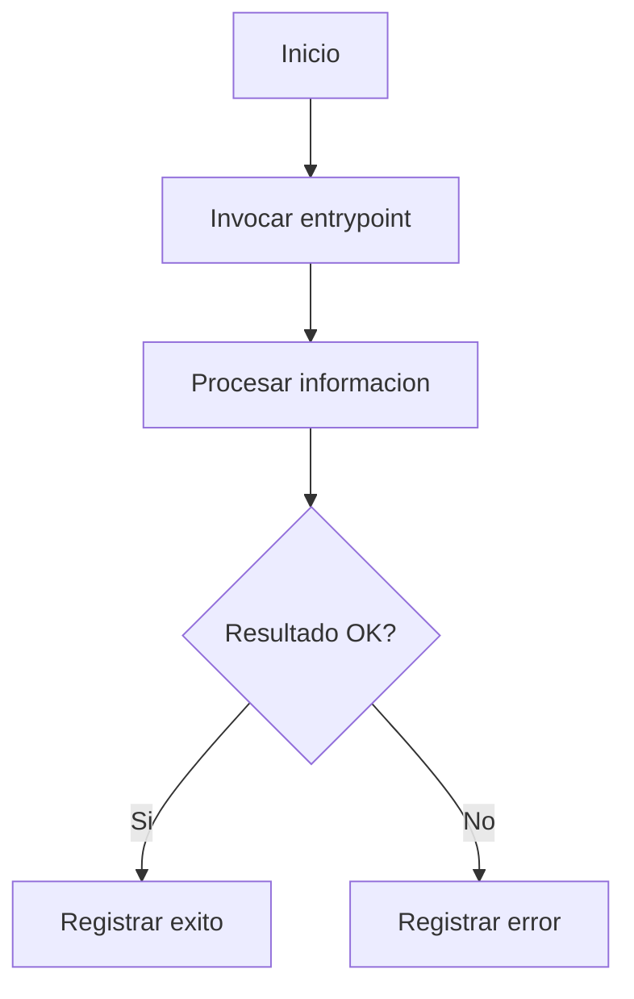
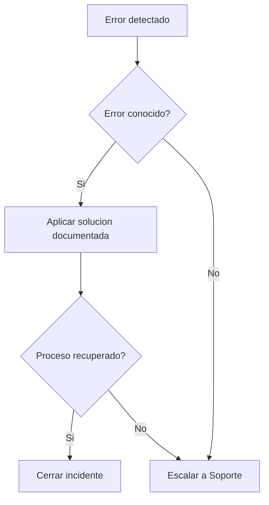
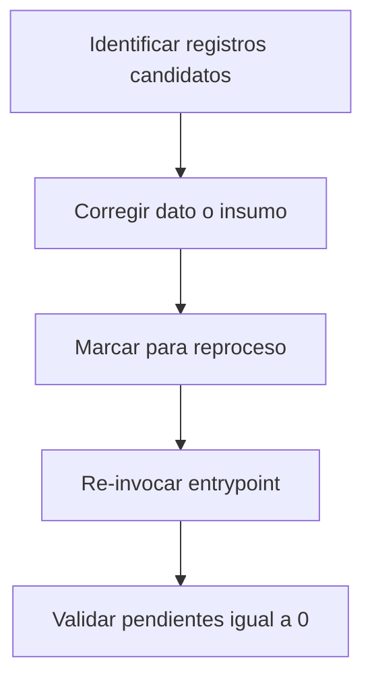
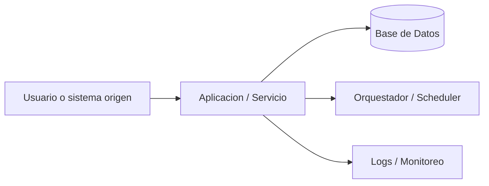

# Documento Operativo — {Nombre del Cambio}

## 1. Identificacion del Producto

| Campo | Valor |
| --- | --- |
| Producto | {Producto o Pendiente de confirmar: producto} |
| Dueno de aplicacion | {Dueno de aplicacion o Pendiente de confirmar: dueno de aplicacion} |
| Plataforma | {Plataforma o Pendiente de confirmar: plataforma} |
| Lider de Proyecto TI | {Lider de Proyecto TI o Pendiente de confirmar: lider de proyecto TI} |
| Desarrollador | {Desarrollador o Pendiente de confirmar: desarrollador} |

### 1.1 Referencias

| Archivo | Descripcion |
| --- | --- |
| {archivo} | {descripcion} |

## 2. Presentacion del Producto

{Parrafo introductorio del cambio: que hace, por que se desarrollo y contexto funcional.}

### 2.1 Objetivo

{Una o dos lineas con el objetivo funcional del cambio.}

### 2.2 Alcance

{Alcance funcional con objetos modificados.}

### 2.3 Sistemas Involucrados

- {Sistema externo, base de datos, aplicacion externa o repositorio externo.}

### 2.4 Calendarizacion

{Si hay tarea programada: nombre del proceso y hora de ejecucion. Si no aplica: No aplica.}

### 2.5 Definiciones, Acronimos y Abreviaciones

| Termino | Definicion |
| --- | --- |
| {termino} | {definicion} |

## 3. Respaldo y depuracion de informacion

{Comandos concretos de respaldo de tablas operativas afectadas y politica de retencion. Si no aplica: No aplica. Si falta evidencia: Pendiente de confirmar.}

## 4. Ejecucion del producto

| Tipo | Nombre | Invocacion | Descripcion |
| --- | --- | --- | --- |
| {procedure/job/endpoint/script} | {entrypoint} | `{comando o invocacion}` | {descripcion operativa} |

### 4.x Invocacion operativa paso a paso

1. {Paso operativo concreto.}
2. {Paso operativo concreto.}
3. {Validacion esperada.}

### Diagrama R1 Flujo Operativo Principal



### 4.1 Procesos de Carga (Aplica para BI)

No aplica.

## 5. FrontEnd

No aplica.

## 6. Monitoreo y diagnostico de informacion

### 6.1 Consultas de monitoreo — proceso OK

```sql
-- Q-MON-OK-1
{SQL que responde si esta procesando adecuadamente}
```

Umbral nominal: {umbral nominal o Pendiente de confirmar: umbral nominal}.

### 6.2 Consultas de monitoreo — proceso con error

```sql
-- Q-MON-ERR-1
{SQL que responde si esta cayendo en error}
```

Umbral: 0.

### 6.3 Deteccion de falla del proceso

Health-check: {health-check o Pendiente de confirmar: health-check}.

Umbral de disparo: {umbral explicito o Pendiente de confirmar: umbral de disparo}.

| Severidad | Condicion | Rol responsable | Accion |
| --- | --- | --- | --- |
| WARNING | {condicion warning} | {rol especifico} | {accion} |
| CRITICAL | {condicion critical} | {rol especifico} | {accion} |

### 6.4 Errores comunes

#### Diagrama R4 Arbol de Decision de Errores



| Error | Causa | Solucion |
| --- | --- | --- |
| {error} | {causa} | {solucion} |

### 6.5 Logs

| Ubicacion | Formato | Retencion |
| --- | --- | --- |
| {ubicacion} | {formato} | {retencion} |

## 7. Administracion de la operacion

### 7.1 Detener el proceso (cuarentena)

```bash
{comando concreto para detener o deshabilitar el entrypoint}
```

Validacion: {validacion de que no llegan nuevas invocaciones}.

### 7.2 Reiniciar el proceso

```bash
{comando concreto de re-habilitacion}
```

Validacion: {validacion de retoma de trafico}.

### 7.3 Actividades periodicas

| Actividad | Frecuencia | Responsable |
| --- | --- | --- |
| {actividad} | {frecuencia} | {responsable} |

## 8. Reproceso

### Diagrama R2 Flujo de Reproceso Funcional



### Pasos de reproceso

#### (a) Identificar registros candidatos — Q-REP-1

```sql
-- Q-REP-1
{query para identificar registros candidatos}
```

#### (b) Marcar para reproceso

```sql
{UPDATE explicito sobre tabla de auditoria/staging, por ejemplo status = 'PENDING' o to_reprocess = 'Y'}
```

#### (c) Corregir el dato/insumo

{Instruccion operativa para corregir el dato o insumo.}

#### (d) Re-invocar el entrypoint

```bash
{comando o invocacion del entrypoint}
```

#### (e) Validar pendientes = 0 — Q-REP-3

```sql
-- Q-REP-3
{query para validar pendientes = 0}
```

## 9. Tecnologias de la aplicacion

### Diagrama R3 Arquitectura Operativa del Desarrollo



- SO: {sistema operativo o Pendiente de confirmar: SO}
- BD: {base de datos o Pendiente de confirmar: BD}
- Seguridad: {mecanismos de seguridad o Pendiente de confirmar: seguridad}
- Servidor aplicaciones: {servidor o Pendiente de confirmar: servidor de aplicaciones}
- Lenguajes: {lenguajes o Pendiente de confirmar: lenguajes}
- Frameworks: {frameworks o Pendiente de confirmar: frameworks}
- Herramientas de orquestacion: {herramientas o Pendiente de confirmar: herramientas de orquestacion}
