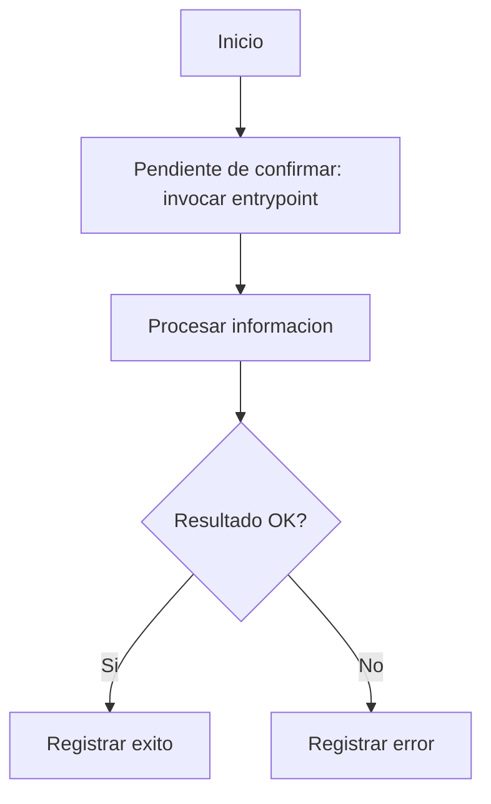
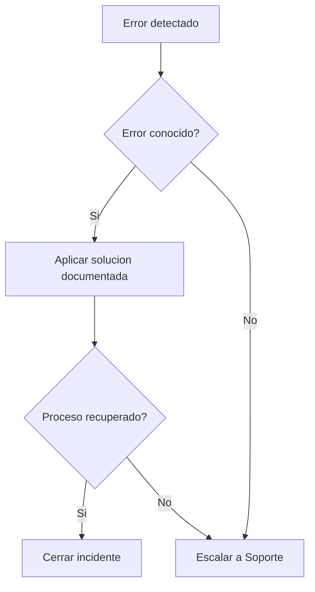
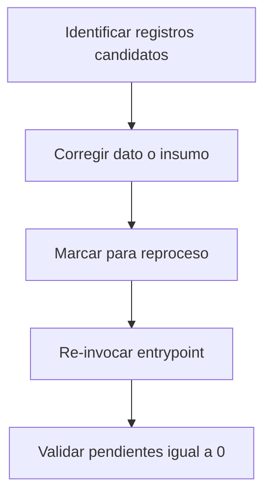
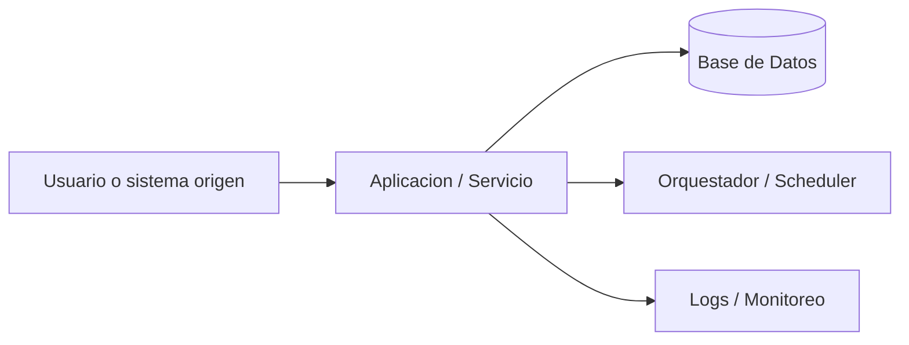

# Documento Operativo — {Nombre del Cambio}

## 1. Identificacion del Producto

| Campo | Valor |
| --- | --- |
| Producto | Pendiente de confirmar: producto. |
| Dueno de aplicacion | Pendiente de confirmar: dueno de aplicacion. |
| Plataforma | Pendiente de confirmar: plataforma. |
| Lider de Proyecto TI | Pendiente de confirmar: lider de proyecto TI. |
| Desarrollador | Pendiente de confirmar: desarrollador. |

### 1.1 Referencias

| Archivo | Descripcion |
| --- | --- |
| Pendiente de confirmar: archivo de referencia. | Pendiente de confirmar: descripcion de referencia. |

## 2. Presentacion del Producto

Pendiente de confirmar: descripcion del cambio, motivo de desarrollo y contexto funcional.

### 2.1 Objetivo

Pendiente de confirmar: objetivo funcional del cambio.

### 2.2 Alcance

Pendiente de confirmar: alcance funcional y objetos modificados.

### 2.3 Sistemas Involucrados

- Pendiente de confirmar: sistema externo, base de datos, aplicacion externa o repositorio externo.

### 2.4 Calendarizacion

Pendiente de confirmar: calendarizacion operativa. Si no corresponde, usar `No aplica.`.

### 2.5 Definiciones, Acronimos y Abreviaciones

| Termino | Definicion |
| --- | --- |
| Pendiente de confirmar: termino. | Pendiente de confirmar: definicion. |

## 3. Respaldo y depuracion de informacion

Pendiente de confirmar: comandos concretos de respaldo, objetos operativos afectados y politica de retencion. Si no corresponde, usar `No aplica.`.

## 4. Ejecucion del producto

| Tipo | Nombre | Invocacion | Descripcion |
| --- | --- | --- | --- |
| Pendiente de confirmar: tipo de entrypoint. | Pendiente de confirmar: nombre del entrypoint. | `Pendiente de confirmar: comando o invocacion.` | Pendiente de confirmar: descripcion operativa. |

### 4.x Invocacion operativa paso a paso

1. Pendiente de confirmar: paso operativo concreto.
2. Pendiente de confirmar: paso operativo concreto.
3. Pendiente de confirmar: validacion esperada.

### Diagrama R1 Flujo Operativo Principal



### 4.1 Procesos de Carga (Aplica para BI)

No aplica.

## 5. FrontEnd

No aplica.

## 6. Monitoreo y diagnostico de informacion

### 6.1 Consultas de monitoreo — proceso OK

```sql
-- Q-MON-OK-1
-- Pendiente de confirmar: consulta o mecanismo de monitoreo para proceso OK.
```

Umbral nominal: Pendiente de confirmar: umbral nominal.

### 6.2 Consultas de monitoreo — proceso con error

```sql
-- Q-MON-ERR-1
-- Pendiente de confirmar: consulta o mecanismo de monitoreo para proceso con error.
```

Umbral: 0.

### 6.3 Deteccion de falla del proceso

Health-check: Pendiente de confirmar: health-check.

Umbral de disparo: Pendiente de confirmar: umbral de disparo.

| Severidad | Condicion | Rol responsable | Accion |
| --- | --- | --- | --- |
| WARNING | Pendiente de confirmar: condicion warning. | Pendiente de confirmar: rol responsable. | Pendiente de confirmar: accion. |
| CRITICAL | Pendiente de confirmar: condicion critical. | Pendiente de confirmar: rol responsable. | Pendiente de confirmar: accion. |

### 6.4 Errores comunes

#### Diagrama R4 Arbol de Decision de Errores



| Error | Causa | Solucion |
| --- | --- | --- |
| Pendiente de confirmar: error comun. | Pendiente de confirmar: causa. | Pendiente de confirmar: solucion. |

### 6.5 Logs

| Ubicacion | Formato | Retencion |
| --- | --- | --- |
| Pendiente de confirmar: ubicacion segura o referencia a logs. | Pendiente de confirmar: formato. | Pendiente de confirmar: retencion. |

## 7. Administracion de la operacion

### 7.1 Detener el proceso (cuarentena)

```bash
Pendiente de confirmar: comando concreto para detener o deshabilitar el entrypoint.
```

Validacion: Pendiente de confirmar: validacion de que no llegan nuevas invocaciones.

### 7.2 Reiniciar el proceso

```bash
Pendiente de confirmar: comando concreto de re-habilitacion.
```

Validacion: Pendiente de confirmar: validacion de retoma de trafico.

### 7.3 Actividades periodicas

| Actividad | Frecuencia | Responsable |
| --- | --- | --- |
| Pendiente de confirmar: actividad periodica. | Pendiente de confirmar: frecuencia. | Pendiente de confirmar: responsable. |

## 8. Reproceso

### Diagrama R2 Flujo de Reproceso Funcional



### Pasos de reproceso

#### (a) Identificar registros candidatos — Q-REP-1

```sql
-- Q-REP-1
-- Pendiente de confirmar: consulta segura para identificar registros candidatos.
```

#### (b) Marcar para reproceso

```sql
-- Pendiente de confirmar: instruccion segura para marcar registros de reproceso.
```

#### (c) Corregir el dato/insumo

Pendiente de confirmar: instruccion operativa para corregir el dato o insumo.

#### (d) Re-invocar el entrypoint

```bash
Pendiente de confirmar: comando o invocacion del entrypoint.
```

#### (e) Validar pendientes = 0 — Q-REP-3

```sql
-- Q-REP-3
-- Pendiente de confirmar: consulta segura para validar pendientes igual a 0.
```

## 9. Tecnologias de la aplicacion

### Diagrama R3 Arquitectura Operativa del Desarrollo



- SO: Pendiente de confirmar: SO.
- BD: Pendiente de confirmar: BD.
- Seguridad: Pendiente de confirmar: mecanismos de seguridad.
- Servidor aplicaciones: Pendiente de confirmar: servidor de aplicaciones.
- Lenguajes: Pendiente de confirmar: lenguajes.
- Frameworks: Pendiente de confirmar: frameworks.
- Herramientas de orquestacion: Pendiente de confirmar: herramientas de orquestacion.
